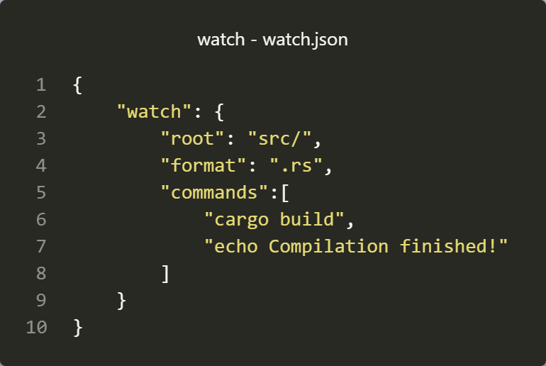

# watch

### watch is a program that notices a change in a file of a directory and sub-directories and executes a list of given commands.

  

### To use it, create a watch.json file, and then you'll need to at least put a watch section that should look like that with the options you want to use:

